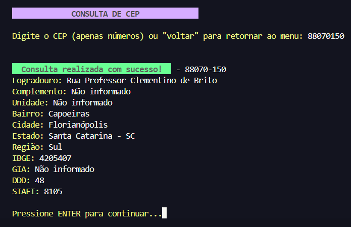
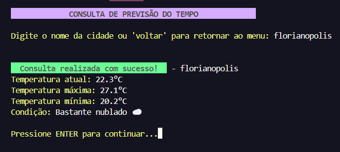

# Chatbot Node.js

Um chatbot interativo de linha de comando que permite consultar informações de CEP e previsão do tempo.

## Pré-requisitos

- [Node.js](https://nodejs.org/) (v18+)

  Ou

- [Docker](https://www.docker.com/) (opcional, se desejar executar com Docker)

## Opções de Execução

### Execução com 100% Docker
```bash
# Construir a imagem do container
docker compose build

# Iniciar o container em modo detached
docker compose up -d

# Executar o aplicativo dentro do container
docker exec -it chatbot-nodejs bash -c 'npm start'
```

### Execução com 100% NodeJS
```bash
# Instalar as dependências
npm install

# Iniciar o aplicativo
npm start
```

### Execução Híbrida (50% NodeJS e 50% Docker)
```bash
# Instalar as dependências localmente
npm i

# Iniciar o container e executar o aplicativo
npm run start:docker
```

## Funcionalidades

### Consulta de CEP
O chatbot permite consultar informações detalhadas de um CEP:



### Previsão do Tempo
Consulte a previsão do tempo para diferentes localidades:

